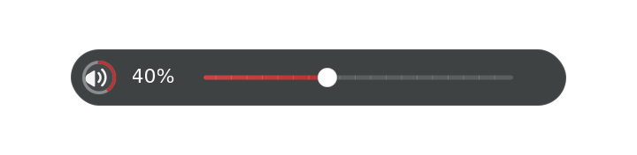
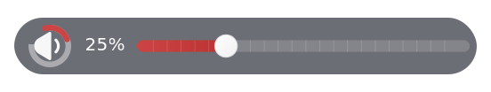
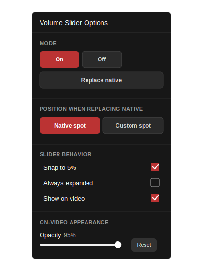
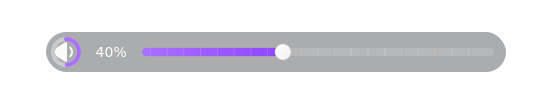
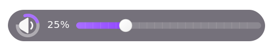
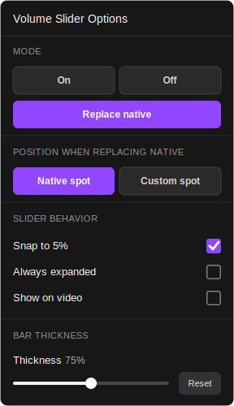

# YouTube and Twitch Volume Sliders

Compact, accessible volume controls for YouTube and Twitch, distributed as standalone userscripts for Tampermonkey and Violentmonkey.

Both scripts replace or complement the sites' native controls with a small indicator that expands into a full slider when needed. They share the same tested core while keeping site-specific behavior isolated.

## Preview

<details open>
<summary>YouTube theme</summary>

<table>
  <tr>
    <td align="center" valign="middle" width="58%">
      <strong>New</strong><br>
      <br><br>
      <strong>Classic</strong><br>
      
    </td>
    <td align="center" valign="middle" width="42%">
      
    </td>
  </tr>
</table>
</details>

<details>
<summary>Twitch theme</summary>

<table>
  <tr>
    <td align="center" valign="middle" width="58%">
      <strong>New</strong><br>
      <br><br>
      <strong>Classic</strong><br>
      
    </td>
    <td align="center" valign="middle" width="42%">
      
    </td>
  </tr>
</table>
</details>

## Install

- [YouTube Volume Slider 2.5.3](https://github.com/Gimbuhh/YouTube-and-Twitch-Volume-Sliders/releases/download/v2.5.3/YouTube.Volume.Slider.2.5.3.user.js)
- [Twitch Volume Slider 2.5.3](https://github.com/Gimbuhh/YouTube-and-Twitch-Volume-Sliders/releases/download/v2.5.3/Twitch.Volume.Slider.2.5.3.user.js)

Install a current userscript manager such as Tampermonkey or Violentmonkey in a modern browser, download the appropriate file above, and open it with the userscript manager. Both scripts update from the committed `dist/` files on `main`.

## Features

- Compact control that expands to a full range slider
- Optional native-control replacement and persistent volume settings
- Adjustable on-video slider size for larger remote-control displays
- Mute-safe restoration across reloads and single-page navigation
- Keyboard and screen-reader accessible mute and options controls
- Site-specific YouTube and Twitch adapters backed by shared UI and lifecycle code

## Development

```sh
pnpm install --frozen-lockfile
pnpm build
pnpm check
pnpm release -- 2.5
```

Edit canonical code under `src/`; never edit `dist/` or archives manually. `dist/` is generated, `archive/legacy/` preserves historical releases, and `archive/releases/` contains immutable packaged releases. See [architecture](docs/architecture.md), [testing](docs/testing.md), [releasing](docs/releasing.md), and [contributing](CONTRIBUTING.md).

The userscripts and this repository are made and maintained with Codex.

`node_modules/` is machine-local and intentionally excluded. Recreate it with the frozen lockfile instead of copying it between Windows and macOS; pnpm installs only native packages for the current machine.

## Releases

Every release contains the standalone `.user.js` files available for that version and matching release notes. The maintained history is recorded in the [changelog](CHANGELOG.md), and the evidence-based [version history](docs/version-history.md) covers original pre-project builds preserved under `archive/legacy/`.

Pull requests and pushes run the full check on Windows. A version tag such as `v2.5` runs the checks again and publishes both verified scripts as GitHub Release assets. See [releasing](docs/releasing.md) for the maintainer workflow.

## Contributing

Bug reports and focused pull requests are welcome. Read [CONTRIBUTING.md](CONTRIBUTING.md) before changing source or generated artifacts. Please report security concerns according to [SECURITY.md](SECURITY.md).

## Privacy

The userscripts make no network requests or telemetry calls. Settings remain in each site's `localStorage`.

## Troubleshooting

Reload the video page after installation, confirm the userscript is enabled for the matching domain, and check that its mode is not set to Off. If site markup changes, run `pnpm check` and report the affected site, browser, userscript manager, and page type.
